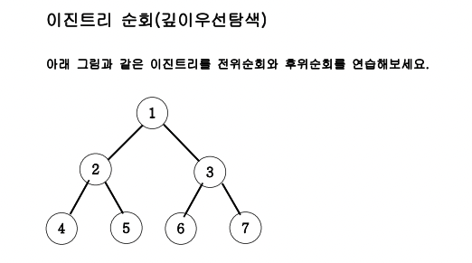

3. 

* 전위순회 출력 : `[1, 2, 4, 5, 3, 6, 7]` 
* 중위순회 출력 : `[4, 2, 5, 1, 6, 3, 7]` 
* 후위순회 출력 : `[4, 5, 2, 6, 7, 3, 1]`

* 이진트리는 왼쪽 자식은 부모노드 * 2, 오른쪽은 부모노드 *2 + 1

* 깊이우선 탐색은 다 왼쪽부터 파고들어감
* 전위는 부모 왼쪽 오른쪽
* 중위는 부모가 중간에 => 왼 부 오
* 후위는 부모가 마지막 => 왼 오 부

