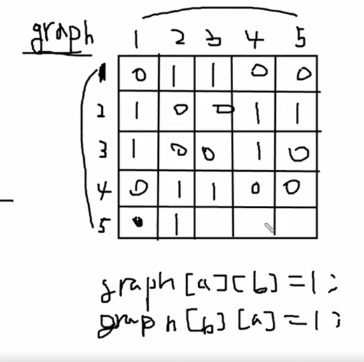

# 이런식으로 그래프를 이차배열로 표현!!


### 무방향
```javascript
const input = [[1,2],[1,3][2,4],[3,4],[2,5]];
```



## 방향그래프

```javascript
const input = [[1, 2], [1, 3], [3, 4], [4, 2], [2, 5]];
```


## 간선 그래프


```javascript
const input = [[1, 2, 2], [2, 5, 5], [4, 2, 2]]
```

