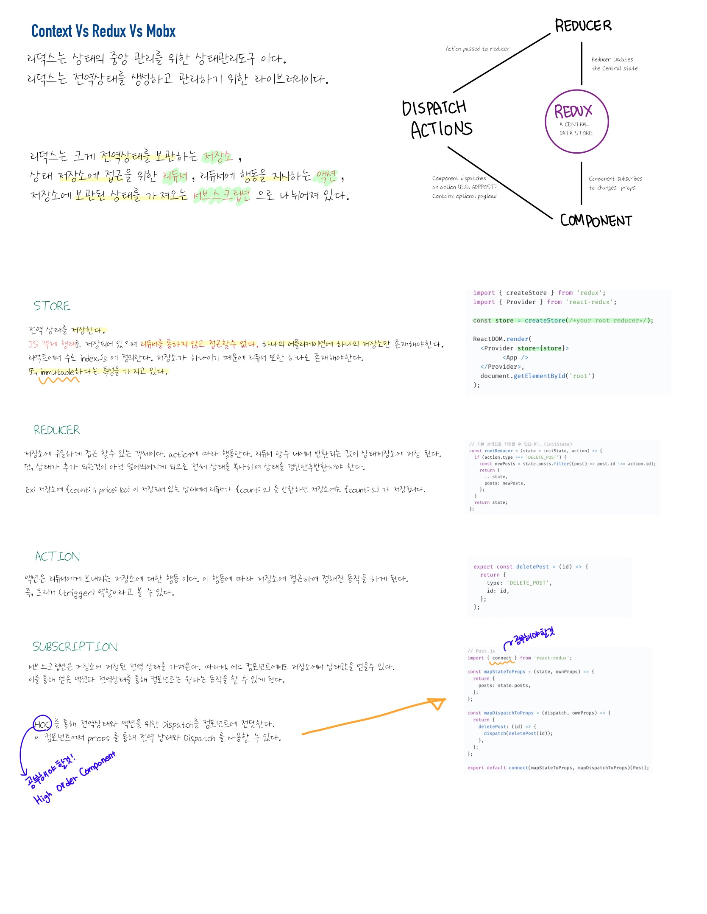

먼저 redux 가 불변성을 가진다는 것은, 

```javascript
const obj1 ={}
const obj2 ={}

obj1 === obj2 // false
```
먼저 obj1 과 obj2 는 둘다 새로운 객체이기 때문에 비교하면 false 이다.   
하지만,
```javascript
const obj1 = {a:2};
const obj2 = obj1.a

obj2 === obj1.a // true
```

위의 경우엔 서로 참조관계가 되기 때문에 true 가 되는 것 이다.    

이걸 리덕스에서 본다면, 

```javascript
const initialState = {
   name: 'suhyeon',
   job: 'developer',
   age: null,
}

const reducer = (state = initialState, action) => {
 switch (action.type) {
     case CASE1:
         return {
             ...state,
             age: action.data,
         };
     default:
         return state;
 }
}
```
위의 경우 새로운 state 값을 return 할 경우 새 객체로 return 해 준다.   
새 객체로 리턴해주면, 전 상태(state)객체와 리턴해준 새로운 객체가 다른것이기 때문에 (false 이기 때문에) 전 state 와 후 state 를 기록 할 수있다.    

새객체가 return 되면 redux 는
age 의 값이 null 에서 우리가 action 으로 넘긴 데이터 값으로 바뀐다는 걸 인지하고 state 값을 추적해준다.   
또한 객체 구조 분해 할당(...state)으로 모든 값을 넣어주되 **바뀌는 부분만** 변경해주어야 된다.     
굳이 하나하나 코드를 똑같이 쓸 필요도 없을 뿐더러 <u>메모리가 낭비되기 때문에</u> 위의 방식으로 해주는것이 좋다.

반대로 이 경우가 아닌

```javascript
const initialState = {
   name: 'suhyeon',
   job: 'developer',
   age: null,
}

const reducer = (state = initialState, action) => {
 switch (action.type) {
     case CASE1:
         return state.age = 25;
         break;
     default:
         return state;
 }
} 
```
만약 새로운 객체를 리턴하지 않는다면 state 객체에서 age 는 25 가 되고 참조관가 되기 때문에 redux는 둘다 true라고 생각하여 데이터의 값을 변경하지 않는다.   


### Redux-persist   

* 기존의 react-redux 의 경우 새로고침을하면 state 값이 init 값으로 돌아가는것을 볼수 있었다.   
* [redux-persist](https://github.com/honeyhyoni/context-redux-mobx/tree/feature/redux-persist) 여기서 확인가능   
> 이에 대응하는 방안을 localStorage, sessionStorage 에 저장해 reducer state 값을 저장하 새로고침 하여도 저장공간에 있는 데이터를 redux 에 불러오는 형식
