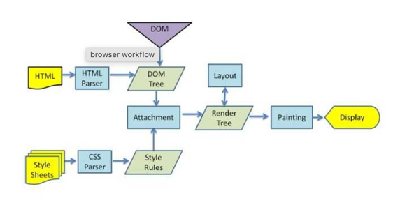

## Virtual Dom   
* virtual dom 은 UI 가상 표현을 메모리 상에 두고 재조정과정을 통해 실제 DOM과 동기화 하는것을 말한다.     
    * 재조정 과정은 크게 3단계로 구성된다. 
        * UI가 변경되면 전체 UI를 Virtual DOM으로 렌더링 한다.
        * 현재 Virtual DOM과 이전 Virtual DOM을 비교해 차이를 계산한다.
        * 변경된 부분을 실제 DOM에 반영한다.


[Angular 의 incremental Dom](https://ui.toast.com/weekly-pick/ko_20210819)


* [왜 Virtual DOM은 브라우저 렌더링 횟수를 줄여주는가?](https://www.paduckk-dev.com/development/%EC%99%9C%20Virtual%20DOM%EC%9D%80%20%EB%B8%8C%EB%9D%BC%EC%9A%B0%EC%A0%80%20%EB%A0%8C%EB%8D%94%EB%A7%81%20%ED%9A%9F%EC%88%98%EB%A5%BC%20%EC%A4%84%EC%97%AC%EC%A3%BC%EB%8A%94%EA%B0%80/)
      
먼저 브라우저 렌더링을 알아야한다. 
  * 브라우전에서 HTML문서를 받으면 DOM Tree 생성
  * render tree 생성
  * Layout(reflow)
  * Painting   
* 하나의 HTML 문서가 그려지기까지 위와 같은 과정을 거치고 만약 DOM을 조작해 뷰가 바뀌어야하면 위의 과정을 반복해 바꾸어진 결과를 보여준다.    
Virtual DOM은 뷰에 변화를 먼저 Virtual DOM에 적용시킨 후 한번에 DOM에 전달해 줌으로써 브라우저내에서 발생하는 양을 줄이면서 성능이 개선된다.      

* 결국 요점은 Virtual DOM을 이용해 렌더링 횟수를 줄여준다.    
    * Virtual DOM은 DOM을 추상화한 DOM이다. (그러면 Virtual DOM의 구체적인 형태가 무엇인가)
    * Virtual DOM을 이용해 여러번 DOM에 업데이트 해야 할 것을 한번에 업데이트 합니다. (리엑트도 결국 라이브러리인데 JS로 이루어진 라이브러리인데 어떻게 DOM 업데이트를 한번에 한다는 것인가 )
    
결국 Virtual DOM 은 DOM 을 추상화해 어떤 태그 Attribute, Child 를 가지는지를 나타낸 트리형태의 자료형이였다.   
Virtual DOM이 DOM Tree 의 여러가지 변경사항이 있을 경우, 어떻게 렌더링 횟수를 줄여줄까?     

```html
<!DOCTYPE html>
<html>
  <head> </head>
  <body>
    <div id="root">
      <ul class="list">
        <li>apple</li>
        <li>banana</li>
        <li>mango</li>
      </ul>
    </div>
  </body>
</html>
```     
위와 같은 구조를 가진 페이지가 있다고 할 경우 `li` 노드들의 컨텐트들을 다음과 같이 바꾸고자 한다.
```html
<!DOCTYPE html>
<html>
  <head> </head>
  <body>
    <div id="root">
      <ul class="list">
        <li>red apple</li>
        <li>yellow banana</li>
        <li>yellow mango</li>
      </ul>
    </div>
  </body>
</html>
```
우선 비효율적 업데이트의 경우
```javascript
const root = document.querySelector('#root')
const liTags = root.querySelectorAll('li')

// 화면 렌더링 발생 1
liTags[0].textContent = 'red apple'

// 화면 렌더링 발생 2
liTags[1].textContent = 'yellow banana'

// 화면 렌더링 발생 3
```
다음과 같이 하나의 업데이트마다 뷰의 변화가 생기면 그 때 마다 브라우저는 다시 화면을 그리는 계산을 하고 이 부분이 잦은 돔조작으로 생기는 성능의 문제점? 이 된다.      

단순한 텍스트 컨텐츠만 바꾼것을 예시로 들었지만, 돔이 사라지고 생기고 레이아웃이나 CSS 속성이 바뀐다면 브라우저는 그래픽 계산을 그 때마다 다시 하기 때문에 비효율적인 업데이트가 된다.      

단 한번의 DOM 조작으로 업데이트를 해보자 

```javascript
const root = document.querySelector('#root')
const virtualDOM = document.createElement('ul')
virtualDOM.classList.add('list')

const appleLI = document.createElement('li')
appleLI.textContent = 'red apple'

const bananaLI = document.createElement('li')
bananaLI.textContent = 'yellow banana'

const mangoLI = document.createElement('li')
mangoLI.textContent = 'yellow mango'

virtualDOM.appendChild(appleLI)
virtualDOM.appendChild(bananaLI)
virtualDOM.appendChild(mangoLI)

// 이 때 한번 뷰가 다시 렌더링 되어 진다.
root.replaceChild(virtualDOM, root.querySelector('ul'))
```

위의 코드에서 replaceChild하기 전에는 자바스크립트 메모리 영역에서만 일어나는 일이므로 화면에 영향을 끼치지 않고 replaceChild 를 할 경우애만 단 한번 화면을 그리는 계산을 하게 된다.     

리엑트를 사용하는것이 무조건적인 성능 향상이 아니라는 점은 위의 예시를 통해 바닐라 자바스크립트도 충분히 구현 가능하다는것을 알 수 있다. 성능적인 측면도 중요하지만 프론트엔드 뷰 라이브러리를 사용했을 때의 장점은 데이터의 흐름과 구성을 일관되게 해준다는 장점을 가지는 것 같다. 리엑트를 사용하기전에는 데이터의 소스와 돔의 조작에 대한 자유도가 높기 때문에 일관된 패턴의 코드를 짜기 어려웠다. 하지만 리액트를 사용함으로써 데이터의 흐륾을 강제하고, 그리고 데이터의 변화에 따른 화면 변화에 보다 덜 신경쓰게 해준다는 점에서 리엑트를 사용하면서의 장점을 이해할 수 있었다. 
